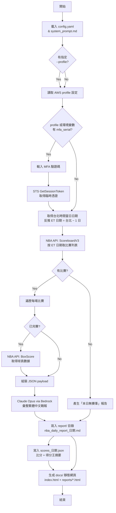

# NBA 每日戰報產生器

一支命令列 Python 程式，用來自動擷取當日 NBA 比賽結果與球員數據，並透過 **Claude Opus 4.7** 彙整成一份繁體中文的 Markdown 戰報。

## 功能說明

執行後會依序完成：

1. **抓資料**：以執行當下的**台北時間**取得當日日期，反推前一日的**美東日期** (Taipei − 1 日)，呼叫 [`nba_api`](https://github.com/swar/nba_api) 的 `ScoreboardV3` 抓該 ET 日期的所有比賽；對已完賽的場次再呼叫 Boxscore 取得球員個人數據（得分、籃板、助攻、抄截、阻攻、失誤、投籃命中率、正負值等）。
2. **彙整報告**：把結構化資料丟給 Claude Opus 4.7，由模型依照固定格式撰寫戰報；標題日期一律使用**台北時間**當日。
3. **寫檔**：輸出到 `report/nba_daily_report_YYYY-MM-DD.md`（檔名中的日期為**台北時間**），`report/` 目錄會自動建立。同時將已完賽場次的「最終比分 + 兩隊得分王」摘要存為 `report/scores_YYYY-MM-DD.json`（台北日期），供靜態網頁渲染「各場比分」區塊使用。
4. **更新靜態網頁**：掃描最近 10 份報告，生成 `docs/index.html` 與 `docs/reports/*.html`，push 後由 GitHub Pages 自動部署。檔名、H1 日期、側邊欄皆使用台北日期；H1 內的日期連結則指向 NBA.com 對應的美東日期 (`nba.com/games?date=ET_DATE`)。若對應日期有 `scores_*.json`，會在 H1 標題下方額外渲染「各場比分」卡片（含隊徽、比分、兩隊得分王 PTS/REB/AST）。

報告固定包含五個段落：

- 當日戰況總覽
- 值得注意的看點
- 關鍵數據
- 特殊事件
- 重要人事異動（若 API 無相關資訊，會明確註明）

## 程式流程



## 專案結構

```
my_ai/
├── requirements.txt             # Python 依賴
├── docs/                        # GitHub Pages 靜態網頁（自動生成）
│   ├── index.html               # 首頁（最新報告）
│   └── reports/                 # 各份獨立頁（最多保留 10 份）
├── utils/
│   ├── __init__.py
│   ├── aws_auth.py              # 共用 AWS MFA 認證模組
│   └── README.md                # utils 模組說明
└── test/
    └── nba_daily_report/
        ├── main.py              # 主程式入口
        ├── config.yaml          # 設定檔 (模型、region、輸出路徑等)
        ├── system_prompt.md     # Claude 的系統提示詞
        ├── README.md            # 本文件
        └── report/              # 產出的每日戰報 (.md，不納入版控)
```

## 安裝

需要 Python 3.9+（使用了 `zoneinfo`）。

本專案的依賴安裝在虛擬環境 `my_ai_venv` 中，執行前請先啟用：

```bash
# 啟用虛擬環境
source my_ai_venv/bin/activate

# 首次安裝依賴（已安裝過可跳過）
pip install -r requirements.txt
```

## 設定

透過 **AWS Bedrock** 呼叫 Claude，需要設定 AWS 憑證。

### 基本 AWS 憑證

先確認 AWS CLI 已設定好 IAM Access Key：

```bash
aws configure
# AWS Access Key ID: ...
# AWS Secret Access Key: ...
# Default region name: us-east-1
```

### MFA 認證（組織 SCP 要求 MFA）

如果組織的 SCP 規則要求 MFA 才能操作，依 MFA 裝置 ARN 的設定來源，程式會採用不同取碼方式：

**方式 1：自動產生 MFA code（透過環境變數）**

將 MFA 裝置 ARN 與 base32 seed 寫入環境變數，程式會以 TOTP 自動產生 6 碼驗證碼，無需互動輸入：

```bash
export AWS_MFA_SERIAL=arn:aws:iam::393326654921:mfa/YOUR_IAM_USER
export AWS_MFA_SEED=YOUR_BASE32_SEED
```

> 注意：若設定 `AWS_MFA_SERIAL` 但未設定 `AWS_MFA_SEED`，程式會報錯，不會 fallback 為互動輸入。

**方式 2：互動輸入 MFA code（透過 profile config）**

將 MFA 裝置 ARN 寫在 `~/.aws/config` 的 profile 中，程式會互動式詢問 6 碼驗證碼：

```ini
[profile cathay-dt-lab]
region = ap-southeast-1
mfa_serial = arn:aws:iam::393326654921:mfa/YOUR_IAM_USER
```

**優先順序：** 環境變數 `AWS_MFA_SERIAL` > profile `mfa_serial`。兩者可以是不同的 MFA 裝置（例如 env 放日常自動化、profile 放高權限需人為確認），env 有設定時一律走自動產生流程。

認證邏輯由共用模組 `utils/aws_auth.py` 的 `setup_aws_session()` 處理，取得的臨時憑證預設有效 12 小時。

若兩者皆未設定，程式會直接使用現有的 AWS credential chain（適合已經有 MFA session 或不需要 MFA 的環境）。

## 使用

確認已啟用虛擬環境（提示符前方應顯示 `(my_ai_venv)`），從專案根目錄 `my_ai/` 執行：

```bash
# 使用 config.yaml 中的 default_profile 和 default_region（最簡用法）
python -m test.nba_daily_report.main

# 覆蓋 profile 或 region
python -m test.nba_daily_report.main --profile other-profile --region us-west-2
```

執行範例輸出（有 MFA，已設定 `AWS_MFA_SEED`）：

```
[*] 使用 AWS profile: cathay-dt-lab
[0/4] 自動產生 MFA code 並取得臨時憑證 ...
      MFA 臨時憑證取得成功，有效至 2026-04-18 12:00:00+00:00
[1/4] 擷取 2026-04-18 (ET) / 2026-04-19 (台北) 的 NBA 比賽資料 ...
      找到 8 場比賽
[2/4] 呼叫 Claude (us.anthropic.claude-opus-4-7) 彙整報告 ...
      Token 用量：input=12345, output=2048, total=14393
[3/4] 已寫入：.../report/nba_daily_report_2026-04-19.md
      已寫入比分摘要：.../report/scores_2026-04-19.json
[4/4] 更新靜態網頁 ...
      已產生 5 份報告至 .../docs
[*] 總執行時間：45.23 秒
```

> 程式設有 **10 分鐘全域 timeout**，超時會自動中止並印出總執行時間。

完成後可透過兩種方式閱讀戰報：

- **本機**：打開 `report/nba_daily_report_2026-04-18.md`
- **網頁**：push 後約 1-2 分鐘，至 GitHub Pages 網址瀏覽（深色主題、左側歷史報告導覽）

## 設計備註

- **時區策略**：網站**對外呈現一律使用台北時間** (Asia/Taipei)，包含檔名 (`nba_daily_report_YYYY-MM-DD.md`)、報告 H1、側邊欄、hero banner。內部抓資料時，以執行當下的台北日期往回減一天做為 ET 查詢日 (`ScoreboardV3(game_date=ET_DATE)`)，避免跨時區日期混淆造成重複。H1 日期連結指向的 `nba.com/games?date=` URL 仍使用 ET 日期（NBA 官方即以 ET 索引賽程）。
- **資料來源**：抓特定 ET 日期用 `nba_api.stats.endpoints.scoreboardv3`（即使非當日亦可查），boxscore 仍走 live 端點。進行中或未開賽的比賽僅帶出比分與隊伍資訊，不拉 box score。
- **模型選擇**：透過 AWS Bedrock 使用 `us.anthropic.claude-opus-4-7`，呼叫時採用 streaming 以避免長輸出 timeout。執行結束時會顯示 input/output token 用量，方便追蹤費用。
- **預設 profile**：`config.yaml` 的 `default_profile` 讓使用者不需每次帶 `--profile` 參數，`--profile` 仍可覆蓋。
- **MFA 支援**：透過 `utils/aws_auth.setup_aws_session()` 共用模組處理。MFA serial 來源決定取碼方式：環境變數 `AWS_MFA_SERIAL` → 以 `pyotp` 從 `AWS_MFA_SEED` 自動產生 MFA code；profile config 的 `mfa_serial` → 互動式詢問。兩者皆可，env 優先；最後透過 STS 取得臨時憑證。
- **人事異動資料**：NBA API 並不提供交易、簽約、教練異動等資訊，因此系統提示要求模型在資料缺乏時明確註明，不可虛構。
- **無賽事處理**：若當日沒有任何比賽，跳過 API 呼叫，直接輸出簡短說明。
- **靜態網頁**：每次執行後自動更新 `docs/`，以 GitHub Pages 免費部署。網頁採深色主題，內含閱讀進度條、左側歷史導覽、RWD 支援，push 後約 1-2 分鐘生效。最多保留最近 10 份報告，舊檔自動刪除。
- **各場比分區塊**：HTML 頁面會在 H1 下方自動渲染卡片式比分摘要，資料來源為 `report/scores_YYYY-MM-DD.json`。該檔由 `main.py` 在產報時生成（`build_scores_summary`），所以歷史報告沒有對應 JSON 就不會顯示此區塊 — 只影響新產出的日期。隊徽直接引用 NBA CDN (`cdn.nba.com/logos/nba/{teamId}/primary/L/logo.svg`)，team id 來自 `nba_api.stats.static.teams`。

## 已知限制

- `nba_api` 走的是非官方封裝，若 NBA 端點或回傳格式變動，可能需要更新套件版本。
- 若在賽事進行中執行（例如台北時間上午，美東比賽仍在進行），尚未完賽的比賽不會有球員數據；建議在台北時間中午後執行（此時絕大多數美東前日賽事已結束），以取得完整戰報。
- 報告內容由 LLM 生成，仍可能有誤讀或遺漏，請作為參考而非權威資料。
